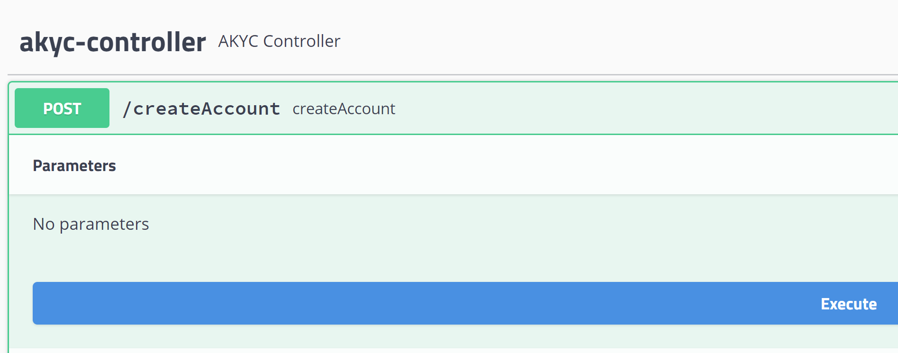
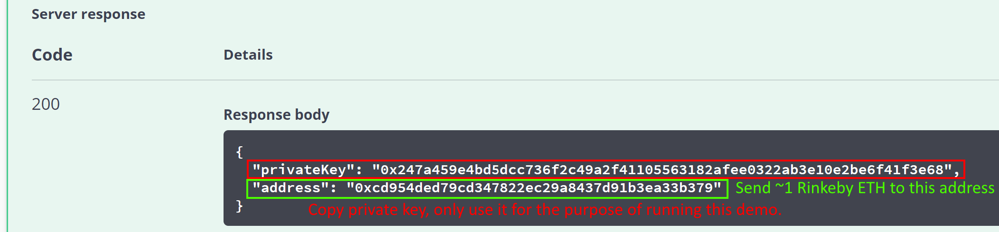
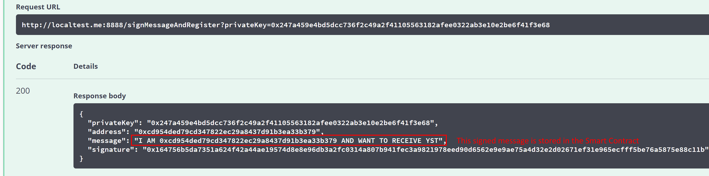

# almost-kyc-token-distribution

## Running the Token Distribution Example on Rinkeby

There are two scenarios for running the Token Distribution Example:
* _Scenario 1: Local Test_  

In the local test scenario, Ganache has to be running with a certain mnemonic. The Contracts (`TokenProspectRegistry` and `UnlimitedCurrencyToken`) are deployed to the local chain and if `check.claims` in the properties is not activated, no external request is executed. 
* _Scenario 2: Remote Test_  

In the remote test scenario, the Java application is connected to the Rinkeby Ethereum Testnet. The application is used for account creation and prospect registration only, the check and Token transfer is executed by an external server process. The external process is not called directly, Smart Contract events are used for messaging and the external server process subscribed to the Registry Contract `registered` events.  

### Runtime Environment Setup

Depending on the scenario, there are two type of setups.

#### For Local Test

* Start Ganache on Port 8545 with mnemonic: *happy stem cram drastic uncover machine unfold year sunny feature cross ignore*
* Run Docker image
```
docker run -d -p 8888:8888 ice0nine/akyc-token-distribution
```
* Open http://127.0.0.1:8888/swagger-ui.html
* Call `/createAccount` (execute)

</img>

* Note down the private key and Ethereum address


* Send 1 ETH to the address
* Call `/signMessageAndRegister` with private key (execute)



#### For Remote Test

Create local `application.properties` in `/var/config`
```
rpc.url=https://rinkeby.infura.io/v3/YOUR_APPLICATION_KEY
address.token=0x24eaf0fca9190c48c490eef3c0facf218cee6711
address.registry=0x10c67eFb6a3D9e7Ce14A85E9Fd498E752c38C2Bc
```

_Windows_
```
docker run -d -p 8888:8888 -e SPRING_CONFIG_LOCATION=/var/config/ -v /var/config:/var/config ice0nine/akyc-token-distribution
```

_Linux/MacOS_
```
docker run -d -p 8888:8888 -e SPRING_CONFIG_LOCATION=/var/config/ -v /var/config:/var/config ice0nine/akyc-token-distribution
```